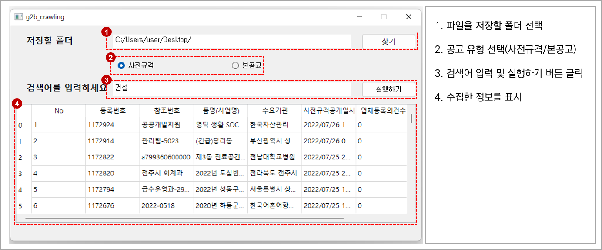

# g2b_crawling
Python을 이용한 나라장터(g2b) 입찰공고 크롤링 프로그램 (g2b_crawling)

----------------------------
사용 라이브러리
----------------------------
- Selenium 
- PyQt5
- Pandas
- webdriver-manager

----------------------------
프로그램 소개
----------------------------
- 지정한 폴더에 사전규격 및 본공고 목록을 엑셀로 저장 
- 사용자가 입력한 키워드와 관련된 최근 1개월 이내의 입찰공고 크롤링

----------------------------
 실행 방법
----------------------------

